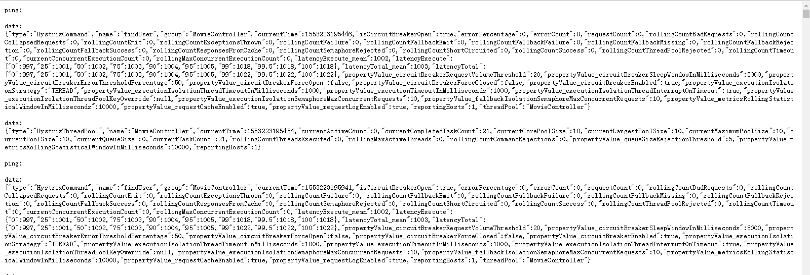
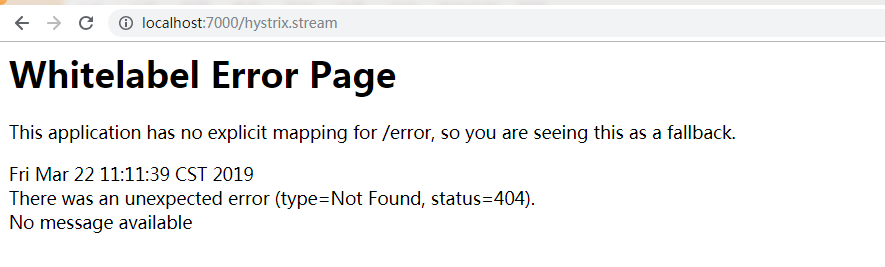
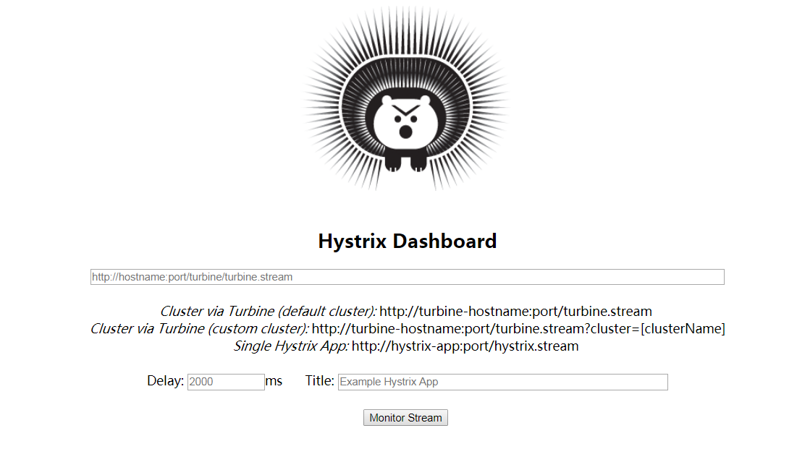
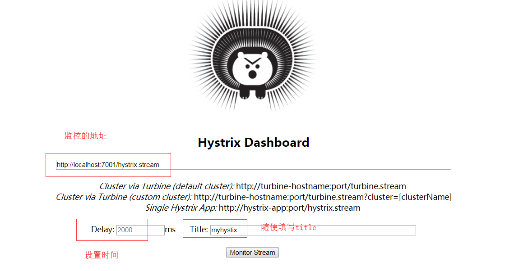
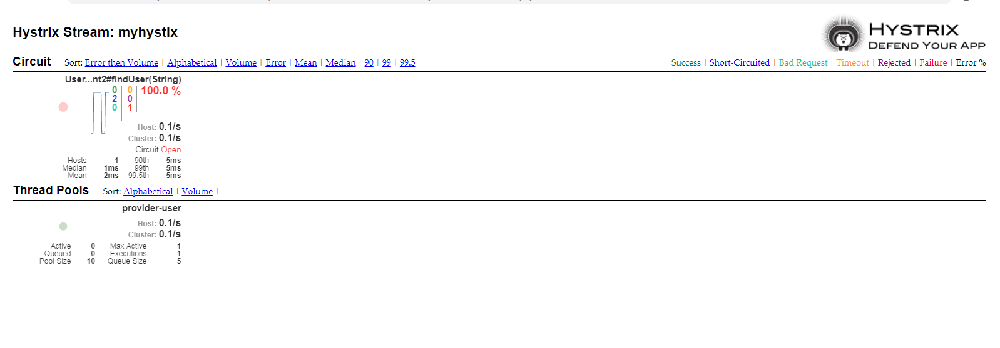
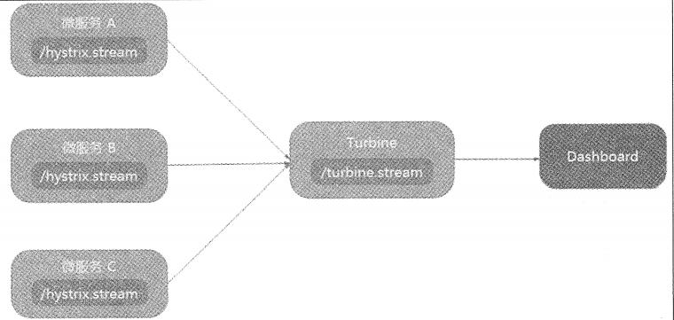
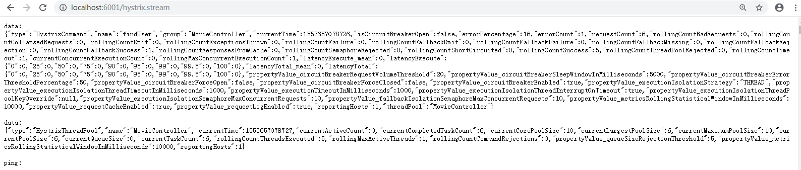
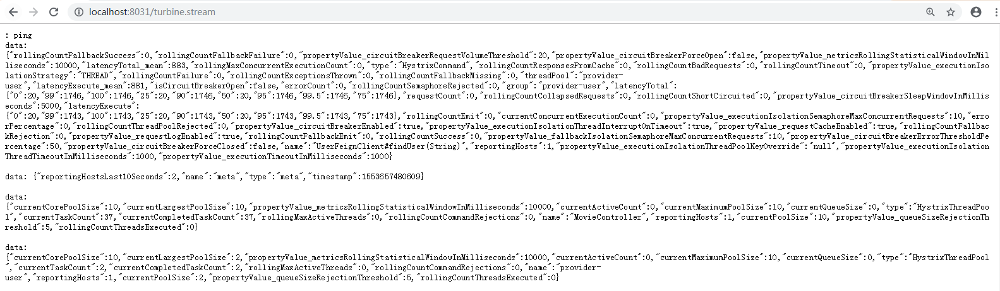
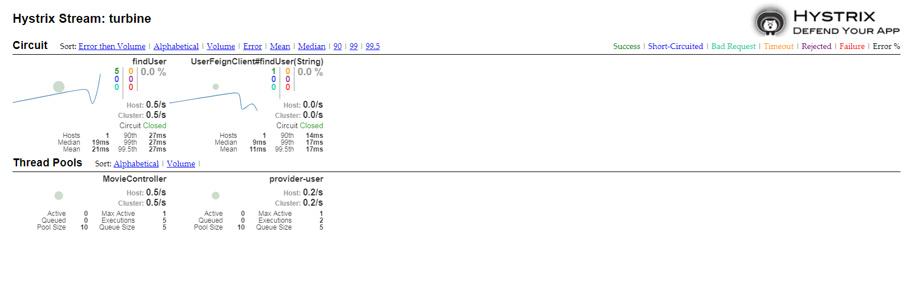

# Hystrix 实现微服务的容错处理

微服务架构的应用系统通常包含过个服务层。微服务之间通过网络进行通信，从而支持起整个应用系统。任何微服务都并非100%可用，网络往往很脆弱，因此难免有些请求会失败。

为了防止雪崩效应，Hystrix提供了容错机制。 容错机制需要实现以下两点：

1. **为网络请求设置超时**

   必须为网络请求设置超时。如果依赖服务不可用或者网络有问题，响应时间就会变得很长。

   一次远程调用对应着一个线程/进程，如果响应太慢，这个线程/进程就得不到释放，资源就会逐渐被耗尽，最终导致服务的不可用。

   

2. **使用断路器模式**

如果对某个微服务的请求有大量超时（微服务不可用或网络有问题），再去让新的请求访问改服务已经没有任何意义，只会无谓消耗资源。

断路器可理解为对容易导致错误的操作的代理。这种代理能够统计一段时间内调用失败的次数，并决定是正常请求依赖服务还是直接返回。

**断路器可以实现快速失败**，如果它在一段时间内检测到许多类似的错误（如超时等），就会在之后的一段时间内，强迫对该服务的调用快速失败，即不在请求所依赖的服务。这样，应用程序就无需再浪费CPU时间去等待长时间的超时。

**断路器也可以自动诊断服务是否已经恢复正常**。如果发现依赖的服务已经恢复正常，那么就会恢复请求该服务。


断路器状态转换逻辑：

- 正常情况下，断路器关闭，可正常请求依赖的服务。
- 当一段时间内，请求失败率达到一定阀值（如错误率达到50%，或100次/分钟等），断路器就会打开。此时，不会再去请求依赖的服务。
- 断路器打开一段时间后，会自动进入“半开”状态。此时，断路器允许一个请求访问依赖的服务。如果该请求能够成功，则关闭断路器；否则继续保持打开状态。


## Hystrix 简介

Hystrix是由Netflix开源的一个延迟和容错库，用于隔离访问远程系统、服务或者第三方库，防止级联失败，从而提升系统的可用性与容错性。Hystrix主要通过以下几点实现延迟和容错。

- 包裹请求：使用`HystrixCommand`(或`HystrixObservableCommand`)包裹对依赖的调用逻辑，每个命令在独立线程中执行。使用到了设计模式中的“命令模式”

- 跳闸机制：当某服务的错误率超过一定阀值时，Hystrix可以自动或手动跳闸，停止请求该服务一段时间。

- 资源隔离：Hystrix为每个依赖都维护了一个小型的线程池（或信号量）。如果该线程池已满，发往该依赖的请求就被立即拒绝，而不是排队等候，从而加速失败判定。

- 监控：Hystrix可以近乎实时地监控运行指标和配置的变化，例如成功、失败、超时、以及被拒绝的请求等。

- 回退机制：当请求失败、超时、被拒绝，或当断路器打开是，执行会逻辑（由开发人员执行提供），例如返回一个缺省值。

- 自我修复：断路器打开一段时间后，会自动进入“半开”状态。断路器打开、关闭、半开的逻辑转换。

  

  ### Hystrix的隔离策略

  Hystrix两种隔离测试：

  - THREAD(线程隔离)：使用该方式，HystrixCommand将会在单独的线程上执行，并发请求受线程池中的线程数据的限制。
  - SEMAPHONRE（信号量隔离）：使用该方式，HystrixCommand将会在调用线程上执行，开销相对较小，并发请求受到信号量个数的限制。

  Hystrix中默认并且推荐使用线程隔离，因为这种方式有一个除网络超时外的额外保护层。

  一般来说，只有当调用负载非常高时（如每个实例每秒调用数百次）才需要使用信号隔离，因为这种场景下使用线程隔离开始比较高。信号量隔离一般仅使用于非网络调用的隔离。

  

  

## 一、简单使用Hystrix

项目demo：`consumer-movie-ribbon-hystrix`

### 1、添加 hystrix依赖

```xml
<!--添加 hystrix-->
<dependency>
    <groupId>org.springframework.cloud</groupId>
    <artifactId>spring-cloud-starter-hystrix</artifactId>
</dependency>
```


### 2、启动类中开启Hystrix(添加`@EnableCircuitBreaker`或`@EnableHystrix`)

```java
@EnableDiscoveryClient
@SpringBootApplication
@EnableCircuitBreaker //开启hystrix 或 @EnableHystrix
public class ConsumerMovieApp
{
    @Bean
    @LoadBalanced
    public RestTemplate restTemplate(){
        return new RestTemplate();
    }
    public static void main( String[] args )
    {
        SpringApplication.run(ConsumerMovieApp.class,args);
    }
}

```


### 3、controller中findUser方法添加容错能力

```java
@RestController
@RequestMapping("/movie")
public class MovieController {


    @Autowired
    private RestTemplate restTemplate;


    @HystrixCommand(fallbackMethod = "findUserFallback") //指定容错的方法
    @GetMapping("/{userId}")
    public User findUser(@PathVariable  String userId){
      return  restTemplate.getForObject("http://provider-user/user/"+userId,User.class);
    }

    /**
     * findUser 的容错方法，返回值和参数与findUser方法一致
     * @param userId
     * @return
     */
    public User findUserFallback(String userId){
        User user = new User();
        user.setUserId("-1");
        user.setUserCode("-1");
        user.setUserName("找不到用户");
        return  user;
    }
}

```

`findUserFallback`方法是`findUser`的回退方法，回退方法和`findUser`必选**具有相同的参数与返回值类型**


当请求失败、被拒绝、超时或者断路器打开时，都会进入回退方法。


## 二、Feign使用Hystrix

上面是使用注解`@HystrixCommand`的`fallbackMethod`属性实现回退的。但是Feign是以接口形式工作的，没有方法体，所以上面的方式不适用于Fegin。

Spring Cloud 默认为Fegin整合了Hystrix，只要Hystrix在项目的classpath中，Fegin默认就会用断路器包裹所有方法。


### （1）方式一：使用fallback指定回退类

项目demo：`consumer-movie-feign-hystrix-fallback`

#### 1、修改Fegin接口，属性fallback指定回退类

```java
/**
 *feign 接口，调用provider-user服务,fallback指定容错回退类
 */
@FeignClient(name = "provider-user",fallback = FeginClientFallback.class)
public interface UserFeignClient {

    @RequestMapping(value = "/user/{userId}",method = RequestMethod.GET)
    User findUser(@PathVariable("userId") String userId); //坑1：注意@PathVariable 要添加value值

}
```


#### 2、编写容错回退类，实现Fegin接口

```java
/**
 * 回退类FeginClientFallBack需要实现Fegin Client接口
 */
@Component
public class FeginClientFallback implements  UserFeignClient{

    @Override
    public User findUser(String userId) {
        User user = new User();
        user.setUserId("-1");
        user.setUserCode("-1");
        user.setUserName("Fegin--> 找不到用户");
        return  user;
    }
}
```

注意：记得添加`@Component`注解。


#### 3、如果是Spring Cloud Dalston之后版本，需要开启Hystrix

application.yml开启hystrix

```yacas
feign:
  hystrix:
    enabled: true
```

说明：从Spring Cloud Dalston开始，Feign默认是不开启Hystrix的。
因此，如使用Dalston请务必额外设置属性：feign.hystrix.enabled=true，否则断路器不会生效。
而，Spring Cloud Angel/Brixton/Camden中，Feign默认都是开启Hystrix的。无需设置该属性。


至此，Fegin完成了Hystrix容错机制。


### （2）方式二：通过Fallback Factory 检查回退原因

使用fallback Factory与fallback不同的是，前者可以获取回退的原因。

项目demo：`consumer-movie-feign-hystrix-fallback`

#### 1、修改Fegin接口，属性fallbackFactory指定回退类

```java
/**
 * 使用fallbackFactory实现容错
 */
@FeignClient(name = "provider-user",fallbackFactory =FeginClientFallbackFactory.class )
public interface UserFeginClient2 {
    @RequestMapping(value = "/user/{userId}",method = RequestMethod.GET)
    User findUser(@PathVariable("userId") String userId); //坑1：注意@PathVariable 要添加value值
}

```


#### 2、编写回退工厂类，实现FallbackFactory接口，并覆写create方法（实现Fegin接口的方法）

```java
/**
 * fallback 容错工厂类，实现FallbackFactory接口，并覆写create方法（实现Fegin接口的方法）
 */
@Component
public class FeginClientFallbackFactory implements FallbackFactory<UserFeginClient2> {

    @Override
    public UserFeginClient2 create(Throwable throwable) {
        //简单打印错误信息
        //Fegin bug: throwable 可能为null
        // 在Spring Cloud Gamden SR4使用的Fegin版本是9.3.1. Fegin 9.4.0才修改修改throwabel为null的bug
        System.out.println(throwable.getMessage());

        //实现Fegin接口，返回容错的信息
        return new UserFeginClient2(){

            @Override
            public User findUser(String userId) {
                User user = new User();
                user.setUserId("-1");
                user.setUserCode("-1");
                user.setUserName("Fegin fallbackFactory --> 找不到用户");
                return  user;
            }
        };


    }
}

```

create方法有异常参数Throwable，可以获取异常信息


#### 3、如果是Spring Cloud Dalston之后版本，需要开启Hystrix

application.yml开启hystrix

```yacas
feign:
  hystrix:
    enabled: true
```


### （3）为Fegin禁用Hystrix

Spring Cloud 默认为Fegin整合了Hystrix。但是很多场景并不需要该功能。如何禁用Hystrix？


#### 为指定Fegin客户端禁用Hystrix


#### 全局禁用Hystrix

```yacas
feign:
  hystrix:
    enabled: false
```


## 三、Hystrix监控

除了容错外，Hystrix还提供了近乎实时的监控。`HystrixCommand`和`HystrixObservableCommand`在执行时，会生成执行结果和运行指标，必然每秒执行的请求数、成功数等，这些监控数据对分析应用系统的状态很有用。


使用Hystrix的模块`hystrix-metrics-event-stream`，就饿开业将这些监控的指标信息以text/event-stream的格式暴露给外部系统。`spring-cloud-starter-hystrix`已包含该模块，在此基础上，只需为项目添加`spring-boot-starter-actuator`就可以使用/hystrix.stream端点获得Hystrix的监控信息了。


### （1）项目添加监控

添加Actuator依赖

```xml
 <dependency>
     <groupId>org.springframework.boot</groupId>
     <artifactId>spring-boot-starter-actuator</artifactId>
</dependency>
```


重新启动，断路器的状态也会暴露在Actuator提供的/health端点中。

断路器关闭的时候，访问http://localhost:6001/health 结果如下

```xml
{
	...
	"hystrix": {
		"status": "UP"
	}
}
```

Hystrix状态为UP，也就是一切正常，此时断路器是关闭的。


停止provider-user服务后，5分钟返回20此失败，Hystrix状态信息为

```xml
{
...
"hystrix": {
		"status": "CIRCUIT_OPEN",
		"openCircuitBreakers": ["MovieController::findUser"]
	}
}
```


访问http://localhost:6001/hystrix.stream  系统会不断刷新获得实时的监控数据。




### （2）Fegin添加监控

项目demo：`consumer-movie-feign-hystrix-fallback-stream`

Fegin 添加Actuator监控，访问/health 可以看到hystrix状态。 

但是访问/hystrix.stream 显示404

http://localhost:7001/hystrix.stream




**解决方案：**

#### 1、除添加Actuator依赖外，增加hystrix依赖

```xml
<!--fegin监控 需要添加hystrix-->
<dependency>
    <groupId>org.springframework.cloud</groupId>
    <artifactId>spring-cloud-starter-hystrix</artifactId>
</dependency>
```


#### 2、启动类添加注解`@EnableCircuitBreaker`

```java
@SpringBootApplication
@EnableEurekaClient
@EnableFeignClients //开启Feign
@EnableCircuitBreaker //开启断路器
public class ConsumerMovieFeignHystrixStreamApp
{

    public static void main( String[] args )
    {
        SpringApplication.run(ConsumerMovieFeignHystrixStreamApp.class,args);
    }
}
```


重新启动项目即可 访问http://localhost:7001/hystrix.stream监控


## 四、使用Hystrix Dashboard可视化监控数据

前面应用了Hystrix的监控，但是访问/hystrix.stream端点的数据是以文字形式展示的。很难分析这些数据。

下面使用Hystrix Dashboard，让监控数据图形化、可视化


项目demo：`hystrix-dashboard`

### 1、新建maven项目，添加依赖

```xml
 <dependencies>
     <dependency>
         <groupId>org.springframework.cloud</groupId>
         <artifactId>spring-cloud-starter-hystrix</artifactId>
     </dependency>
     <dependency>
         <groupId>org.springframework.cloud</groupId>

         <artifactId>spring-cloud-starter-netflix-hystrix-dashboard</artifactId>
     </dependency>
     <dependency>
         <groupId>org.springframework.boot</groupId>
         <artifactId>spring-boot-starter-actuator</artifactId>
     </dependency>
</dependencies>
```


### 2、启动类添加`@EnableHystrixDashboard `

```java
/**
 * HystrixDashboard 服务
 */
@SpringBootApplication
@EnableHystrixDashboard //开启dashboard
public class HystrixDashboardApp
{
    public static void main( String[] args )
    {
        SpringApplication.run(HystrixDashboardApp.class,args);
    }
}
```


### 3、设置端口

```yaml
server:
  port: 8030
```


启动范围：http://localhost:8030/hystrix




上一节中访问http://localhost:7001/hystrix.stream 监控hystrix，文字方式呈现。




不断访问被监控的服务，hystrix bashboard的监控显示如下：



## 五、使用Turbine聚合监控数据

### 1、Turbine简介

前文中使用/hystrix.stream端点监控单个微服务实例。然而，使用微服务的应用系统一般会包含若干个微服务，每个微服务通常都会部署多个实例。如果每次只能查看单个实例的监控，需要在Hystrix Dashboard上切换要监控的地址，这样很不方便。 

准对上述问题，使用Turbine监控工具。

> Turbine 是一个聚合Hystrix监控数据的工具，它可将所有相关/hystrix.stream端点的数据聚合到一个组合的/turbine.stream中，从而让集群的监控更加方便。


### 2、使用Turbine监控多个微服务

架构如下：




#### 第一步：编写一个Turbine项目

项目：`hystrix-turbine`

##### （1）maven 引入turbine 

```xml
<dependency>
     <groupId>org.springframework.cloud</groupId>
     <artifactId>spring-cloud-starter-netflix-turbine</artifactId>
</dependency>
```


##### （2）编写application.yml，添加监控的微服务

```yaml
server:
  port: 8031
spring:
  application:
    name: hystrix-turbine

# 注册中心
eureka:
  client:
    service-url:
      defaultZone: http://localhost:8761/eureka/


turbine:
  cluster-name-expression: "'default'"
  app-config: consumer-movie-ribbon-hystrix,consumer-movie-feign-hystrix-fallback-stream #监控的微服务
```

- `turbine.app-config`：监听的微服务，对应在注册中心的名字。注意：监听的微服务必须是实现了Hystrix监控的程序，即可要访问/hystrix.stream> 文字监控


##### （3）在启动类中添加@EnableTurbine注解

```java
/**
 * HystrixDashboard 服务
 */
@SpringBootApplication
@EnableTurbine
public class HystrixTurbineApp
{
    public static void main( String[] args )
    {
        SpringApplication.run(HystrixTurbineApp.class,args);
    }
}

```


#### 第二步、依次启动服务

1、启动注册中心：`eureka-server-ha`

2、启动服务提供者：`provider-user`

3、启动需要监控的消费者：`consumer-movie-ribbon-hystrix`、`consumer-movie-feign-hystrix-fallback-stream`

​        访问<http://localhost:6001/hystrix.stream>  和 <http://localhost:6002/hystrix.stream>  会输出文字形式的监控数据




4、启动Turbine监控程序：`hystrix-turbine`  

​        访问<http://localhost:8031/turbine.stream> ，会输出第三步的监控组合数据




5、启动Hystrix Dashboard监控程序：`hystrix-dashboard`

​      访问http://localhost:8030/hystrix.stream 出现监控界面，如下


监控地址填写turbine程序的监控地址：<http://localhost:8031/turbine.stream>，设置delay和title后 进去监控，效果如下：




### 3、使用消息中间件收集数据监控

如果微服务与Turbine网络不通的情况下，上面的方式是无法正常监控的。 为了解决这问题，可借助消息中间件实现数据收集。各个微服务将Hystrix Command的监控数据发送至消息中间件，Turbine消费消息中间件中的数据。


