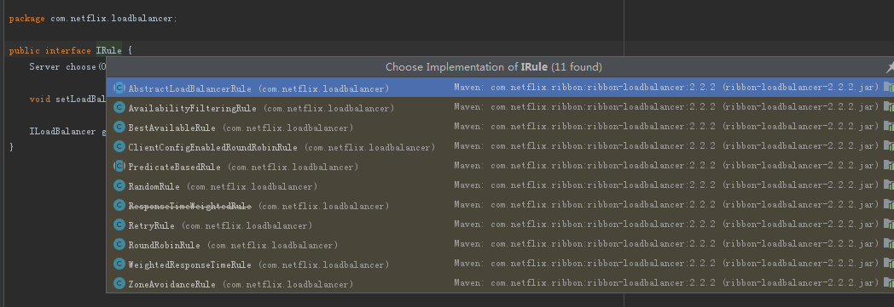
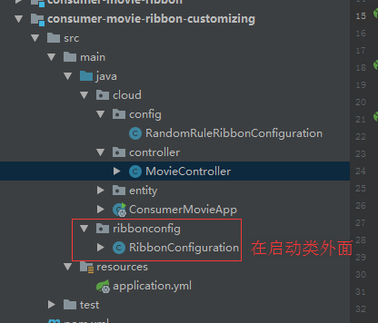

# Ribbon实现客户端负载均衡

> Ribbon 是Netflix发布的负载均衡器，它有助于控制HTTP和TCP客户端的行为。为Ribbon配置服务提供者地址列表后，Ribbon就可基于某种负载均衡算法，自动地帮助服务消费者去请求。Ribbon默认为我们提供了很多的负载均衡算法，例如轮询、随机、加权等。 也可以为Ribbon实现自定义的负载均衡算法。


## 一、为服务消费者整合Ribbon

项目：`consumer-movie-ribbon`

### 1、引入Ribbon依赖

```xml
<dependency>
    <groupId>org.springframework.cloud</groupId>
    <artifactId>spring-cloud-starter-ribbon</artifactId>
</dependency>
```

由于服务添加了`spring-cloud-starter-eureka`，里面包含了`spring-cloud-starter-ribbon`。所有这里不用引入`spring-cloud-starter-ribbon`。


### 2、为RestTemplate添加`@LoadBalanced`注解

```java
@Bean
@LoadBalanced  //添加此注解后，RestTemplate整合Ribbon，使其具备负载均衡的能力
public RestTemplate restTemplate(){
    return new RestTemplate();
}
```


### 3、Controller 负载均衡访问服务

```java
@RestController
@RequestMapping("/movie")
public class MovieController {

    @Autowired
    private RestTemplate restTemplate;

    @Autowired
    private LoadBalancerClient loadBalancerClient;

    /**
     * 获取用户 restTemplate已整合Ribbon 负载均衡
     * @param userId
     * @return
     */
    @GetMapping("/{userId}")
    public User findUser(@PathVariable  String userId){
      return  restTemplate.getForObject("http://provider-user/user/"+userId,User.class);
    }

    /**
     * 测试客户端负载均衡
     */
    @GetMapping("/testLaladBalance")
    public void testLaladBalance(){
        ServiceInstance serviceInstance = loadBalancerClient.choose("provider-user");
        // 打印当前选择的是哪个节点
        System.out.println("访问"+serviceInstance.getServiceId()+"---》"+serviceInstance.getHost()+":"+serviceInstance.getPort());
    }
}
```


## 二、使用java代码自定义Ribbon配置

很多场景下，可能根据需要自定义Ribbon的配置，例如修改Ribbon的负载均衡规则等。Spring Cloud Camden允许使用**java代码**或**属性自定义Ribbon**的配置，这两种方式是等价的。

Ribbon负载均衡策略有：



| 策略名                    | 策略声明                                                     | 策略描述                                                     | 实现说明                                                     |
| ------------------------- | ------------------------------------------------------------ | ------------------------------------------------------------ | ------------------------------------------------------------ |
| BestAvailableRule         | public class BestAvailableRule extends ClientConfigEnabledRoundRobinRule | 选择一个最小的并发请求的server                               | 逐个考察Server，如果Server被tripped了，则忽略，在选择其中ActiveRequestsCount最小的server |
| AvailabilityFilteringRule | public class AvailabilityFilteringRule extends PredicateBasedRule | 过滤掉那些因为一直连接失败的被标记为circuit tripped的后端server，并过滤掉那些高并发的的后端server（active connections 超过配置的阈值） | 使用一个AvailabilityPredicate来包含过滤server的逻辑，其实就就是检查status里记录的各个server的运行状态 |
| WeightedResponseTimeRule  | public class WeightedResponseTimeRule extends RoundRobinRule | 根据相应时间分配一个weight，相应时间越长，weight越小，被选中的可能性越低。 | 一个后台线程定期的从status里面读取评价响应时间，为每个server计算一个weight。Weight的计算也比较简单responsetime 减去每个server自己平均的responsetime是server的权重。当刚开始运行，没有形成statas时，使用roubine策略选择server。 |
| RetryRule                 | public class RetryRule extends AbstractLoadBalancerRule      | 对选定的负载均衡策略机上重试机制。                           | 在一个配置时间段内当选择server不成功，则一直尝试使用subRule的方式选择一个可用的server |
| RoundRobinRule            | public class RoundRobinRule extends AbstractLoadBalancerRule | roundRobin方式轮询选择server                                 | 轮询index，选择index对应位置的server                         |
| RandomRule                | public class RandomRule extends AbstractLoadBalancerRule     | 随机选择一个server                                           | 在index上随机，选择index对应位置的server                     |
| ZoneAvoidanceRule         | public class ZoneAvoidanceRule extends PredicateBasedRule    | 复合判断server所在区域的性能和server的可用性选择server       | 使用ZoneAvoidancePredicate和AvailabilityPredicate来判断是否选择某个server，前一个判断判定一个zone的运行性能是否可用，剔除不可用的zone（的所有server），AvailabilityPredicate用于过滤掉连接数过多的Server。 |


在Spring Cloud中，Ribbon默认的配置类是`RibbonClientConfiguration`。也可以自定义配置覆盖默认配置。

`RibbonClientConfiguration` 策略选择源码：

```java
@Bean
@ConditionalOnMissingBean
public IRule ribbonRule(IClientConfig config) {
    if (this.propertiesFactory.isSet(IRule.class, this.name)) {
        return (IRule)this.propertiesFactory.get(IRule.class, config, this.name);
    } else {
        ZoneAvoidanceRule rule = new ZoneAvoidanceRule();
        rule.initWithNiwsConfig(config);
        return rule;
    }
}
```


项目demo ：`consumer-movie-ribbon-customizing`


### 1、创建自定义负载规则类

```java
/**
 * 自定义Ribbon的负载规则
 * 注意：该类不应该在主应用程序上下文的@ComponentScan 中；否则为全局共享
 */
@Configuration
public class RibbonConfiguration {

    @Bean
    public IRule ribbonRule(){
        // 负载均衡规则，改为随机
        return new RandomRule();
    }
}
```

**注意：该类不应该在主应用程序上下文的@ComponentScan 中；否则为全局共享**


### 2、创建规则配置类，指定负载规则

```java
/**
 * 使用RibbonClient，为特定name的Ribbon Client自定义配置.
 * 使用@RibbonClient的configuration属性，指定Ribbon的配置类.
 * 可参考的示例：
 * http://spring.io/guides/gs/client-side-load-balancing/
 */
@Configuration
@RibbonClient(name = "provider-user",configuration = RibbonConfiguration.class)
public class RandomRuleRibbonConfiguration {
}
```

`@RibbonClient`指定了provider-user服务使用本规则，configuration属性指定自定义规则。


完成以上两步，调用provider-user服务时则会使用自定义的负载均衡规则了。


代码结构如下：



不应该在主应用程序上下文的@ComponentScan 中；否则为全局共享


## 三、使用属性自定义Ribbon配置

项目demo：`consumer-movie-ribbon-customizing-properties`


### 1、application.yml 添加负载规则

```yaml
# 自定riddon的负载规则为随机（RandomRule）
provider-user: # 调用的服务名称
  ribbon:
    NFLoadBalancerRuleClassName: com.netflix.loadbalancer.RandomRule
```


## 四、脱离Eureka使用Ribbon

Eureka中包含了Ribbon，如果不用Eureka Server作为注册中心，如果使用Ribbon实现负载均衡？


项目：`consumer-movie-without-eureka`

### 1、引入Ribbon依赖

```xml
<dependency>
    <groupId>org.springframework.cloud</groupId>
    <artifactId>spring-cloud-starter-eureka</artifactId>
</dependency>
```

修改为：

```xml
<dependency>
    <groupId>org.springframework.cloud</groupId>
    <artifactId>spring-cloud-starter-ribbon</artifactId>
</dependency>
```


### 2、启动类去掉启动Eureka的注解

因为项目已经脱离了Eureka，所以启动类去掉`@EnableDiscoveryClient`或`@EnableEurekaClient`。


### 3、修改application.yml 客户端请求地址

```yaml
server:
  port: 9092
spring:
  application:
    name: consumer-movie-without-eureka

# ribbon配置
provider-user:
  ribbon:
    NFLoadBalancerRuleClassName: com.netflix.loadbalancer.RandomRule # 随机访问
    listOfServers: http://192.168.3.108:8081,http://192.168.3.108:9091 # ribbon客户端请求的列表地址
```


