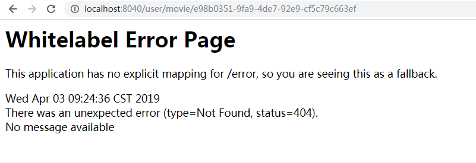
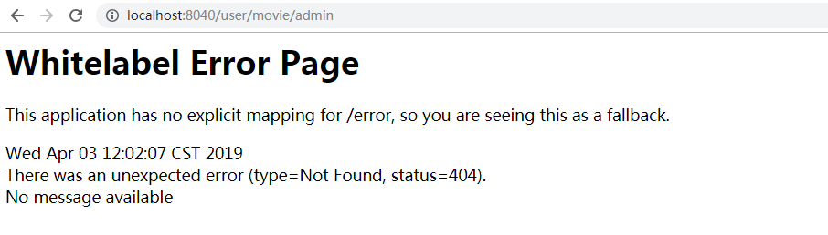

# 一、Zuul简介

Zuul是Netflix开源的微服务网关，它可以和Eureka、Ribbon、Hystrix等组件配合使用。

Zuul的核心是一系列的过滤器，这些过滤器可以完成以下功能。

- 身份认证与安全：识别每个资源的验证要求，并拒绝那些与要求不符的请求。
- 审查与监控：在边缘位置追踪有意义的数据和统计结果，从而带来精确的生成视图。
- 动态路由：动态地将请求路由到不同的后端集群。
- 压力测试：逐渐增加指向集群的流量，以了解性能。
- 负载分配：为每一种负载类型分配对应容量，并弃用超出限定值的请求。
- 静态响应处理：在边缘位置直接建立部分响应，从而避免其转发到内部集群。
- 多区域弹性：跨越AWS Region进行请求路由，旨在实现ELB（Elastic Load Balancing）使用的多样化，以及让系统的边缘更贴近系统的使用者。


Spring Cloud对Zuul进行了整合与增强。目前，Zuul使用默认HTTP客户端是Apache HTTP Client，也可以使用RestClient或者okhttp3.OKHttpClient.


# 二、编写Zuul微服务网关

项目：`gateway-zuul`

## 1、添加项目依赖

Zuul依赖`spring-cloud-starter-netflix-zuul`和eureka 客户端`spring-cloud-starter-netflix-eureka-client`

```xml
 <dependency>
     <groupId>org.springframework.cloud</groupId>
     <artifactId>spring-cloud-starter-netflix-zuul</artifactId>
</dependency>
<dependency>
    <groupId>org.springframework.cloud</groupId>
    <artifactId>spring-cloud-starter-netflix-eureka-client</artifactId>
</dependency>
```


## 2、在启动类上添加注解`@EnableZuulProxy`

`@EnableZuulProxy`：声明一个Zuul代理，该代理使用Ribbon来定位注册在Eureka Server中的微服务；同时还整合了Hystrix，从而实现类容错，所有经过Zuul的请求都会在Hystrix命令中执行。

```java
@SpringBootApplication
@EnableZuulProxy  
public class GatewayZuulApp
{
    public static void main( String[] args )
    {
        SpringApplication.run(GatewayZuulApp.class,args);
    }
}
```


## 3、编写application.yml配置

```yaml
spring:
  application:
    name: gateway-zuul
server:
  port: 8040

# eureka 配置
eureka:
  client:
    service-url:
      defaultZone: http://localhost:8761/eureka #Eureka Server交互地址，查询服务和注册服务都需要依赖这个地址，多个用逗号分隔。
  instance:
    prefer-ip-address: true
```

可以看到，这里没有写Zuul的配置。只是简单将Zuul注册到Eureka Server上。 

因为默认情况下，Zuul会代理所有注册到Eureka Server的微服务，并且Zuul的理由规则如下：

- http://ZUUL_HOST:ZUUL_PORT/微服务在Eureka上的serviceId/**

  访问以上地址会转发到serviceIdd对应的微服务。


## 4、启动项目测试

1、 启动注册中心：`eureka-server-ha`

2、启动服务提供者：`provider-user`

3、启动服务消费者：`consumer-movie-ribbon`

4、启动zuul：`gateway-zuul`


访问：<http://localhost:8040/consumer-movie-ribbon/movie/e98b0351-9fa9-4de7-92e9-cf5c79c663ef> 

会转发到

<http://localhost:9092/movie/e98b0351-9fa9-4de7-92e9-cf5c79c663ef> 


zuul可以使用Ribbon达到负载均衡的效果，也可以使用Hystrix容错和监控。


# 三、Zuul路由端点

当`@EnableZuulProxy`与`Spring Boot Actuator`配合使用时，`Zuul`会暴露一个路由管理端点`/routes`，借助这个端点，可以方便、直观查看以及管理Zuul的路由。

由于`spring-cloud-starter-zuul`已经包含了`spring-boot-starter-actuator`，因此上面例子已经具备路由管理能力。

访问：<http://localhost:8040/routes>   

路由结果：

```json
{
	"/user/**": "consumer-movie-ribbon",
	"/consumer-movie-ribbon/**": "consumer-movie-ribbon",
	"/eureka-server/**": "eureka-server",
	"/provider-user/**": "provider-user"
}
```


**Tips：**使用`routes` 端点的前提

1. Zuul Server需要有Spring Boot Actuator的依赖，否则访问`/routes` 端点将会返回404；
2. 设置`management.security.enabled = false` ，否则将会返回401；也可添加Spring Security的依赖，这样可通过账号、密码访问`routes` 端点。


参考：<http://www.itmuch.com/spring-cloud/edgware-zuul-routes-endpoint/> 


# 四、路由配置详解

## 1、自定义指定微服务的访问路径

配置`zuul.routes.指定微服务的serviceId=指定路径`

```yaml
zuul:
  routes:
    consumer-movie-ribbon: /user/**
```

consumer-movie-ribbon 微服务就会被映射到`/user/**`路径


consumer-movie-ribbon微服务的请求地址是：<http://localhost:9092/movie/e98b0351-9fa9-4de7-92e9-cf5c79c663ef> 

zuul网关路由映射到`/user/**`路径，对应的访问地址是：<http://localhost:8040/user/movie/e98b0351-9fa9-4de7-92e9-cf5c79c663ef> 


**注意：**

`/user/**`和`/user/*`的区别

- `/**`是代表多层目录，如`/user/a/b/c`都能匹配到

- `/*`只是一层目录，只能`/user/a`或`/user/b`

  

  修改上面`zuul.routes`配置：

  ```yaml
  zuul:
    routes:
      consumer-movie-ribbon: /user/*
  ```

  重新启动`gateway-zuul`，访问<http://localhost:8040/user/movie/e98b0351-9fa9-4de7-92e9-cf5c79c663ef>  会报404 

  

  因为consumer-movie-ribbon 微服务就会被映射到`/user/*`路径 ，user后面只能是一层，访问路径不匹配。

  


## 2、忽略指定微服务

使用`zuul.ignored-services`配置需要忽略的服务，多个用逗号分隔

```yaml
zuul:
  ignored-services: consumer-movie-ribbon
```

上面配置则忽略consumer-movie-ribbon服务，只代理其他微服务


访问/routes 查看路由端点

```json
{
	"/eureka-server/**": "eureka-server",
	"/gateway-zuul/**": "gateway-zuul",
	"/provider-user/**": "provider-user"
}
```

忽略了consumer-movie-ribbon服务


## 3、忽略所有微服务，只路由指定微服务

如果只想让Zuul代理指定的微服务，可以将`zuul.ignored-services`设置为`'*'`

```yaml
zuul:
  routes:
    consumer-movie-ribbon: /user/**
  ignored-services: '*'
```

- `ignored-services: '*' ` ：忽略所有微服务

  

Zuul只路由consumer-movie-ribbon微服务

访问/routes 查看路由端点

```json
{
	"/user/**": "consumer-movie-ribbon"
}
```

可以看出只是路由指定的consumer-movie-ribbon微服务


## 4、同时指定微服务的serviceId和对应路径

```yaml
zuul:
  routes:
    user-route:  # user-route只是给路由一个名称，可以任意起名
      service-id: consumer-movie-ribbon #微服务id
      path: /user/**  #service-id对应的路径
```

效果和1一样


## 5、同时指定path和URL

```yaml
zuul:
  routes:
    user-route:  # user-route只是给路由一个名称，可以任意起名
      url: http://localhost:9092/ # 指定的url
      path: /api/**  # url对应的路径。
```

这样就可以将`/api/**`映射到`http://localhost:9092/**`

疑问：为什么测试url使用`http://localhost:9092/`?

​     因为启动的服务消费者者`consumer-movie-ribbon`端口是9092，访问服务提供者获取用户信息的地址是：`http://localhost:9092/movie/e98b0351-9fa9-4de7-92e9-cf5c79c663ef`


上面zuul配置，将`/api/**`映射到`http://localhost:9092/**`，即网关地址`http://localhost:8040/api/ `

会转发到`http://localhost:9092/`；所有访问经过网关的地址`http://localhost:8040/api/movie/e98b0351-9fa9-4de7-92e9-cf5c79c663ef` 即可请求到`http://localhost:9092/movie/e98b0351-9fa9-4de7-92e9-cf5c79c663ef`


**注意：** 使用这种方式配置的路由不会作为`HystrixCommand`执行，也不能使用`Ribbon`来负载均衡多个URL。


## 6、同时指定path和URL，并且不破坏Zuul的Hystrix、Ribbon特性


```yaml
zuul:
  routes:
    user-route:  # user-route只是给路由一个名称，可以任意起名
      path: /api/**  # service-id映射的路径。
      service-id: consumer-movie_my  #自定义一个service-id

# 为Ribbon禁用Eureka
ribbon:
  eureka:
    enabled: false

# 自定义servie-id的ribbon
consumer-movie_my:
  ribbon:
    listOfServers: localhost:9092,localhost:9093
```

- Ribbon禁用Eureka
- 设置自定义的service-id，并设置ribbon复制的地址


1、 启动注册中心：`eureka-server-ha`

2、启动服务提供者：`provider-user`

3、启动两个服务消费者：`consumer-movie` 端口分别为9092和9093。

   访问地址：`http://localhost:9092/movie/e98b0351-9fa9-4de7-92e9-cf5c79c663ef`和

`http://localhost:9093/movie/e98b0351-9fa9-4de7-92e9-cf5c79c663ef>`都可以获取用户信息

4、启动zuul：`gateway-zuul`，访问：`http://localhost:8040/api/movie/e98b0351-9fa9-4de7-92e9-cf5c79c663ef`  会负载均和到第三步的那两个地址。


## 7、使用正则表达式指定Zuul的路由规则

项目：`gateway-zuul-reg-exp`

使用`PatternServiceRouteMapper`实现从微服务到映射路由的正则配置。

```java
@SpringBootApplication
@EnableZuulProxy  //声明一个Zuul代理，该代理使用Ribbon来定位注册在Eureka Server中的微服务；同时还整合了Hystrix，从而实现类容错，
//所有经过Zuul的请求都会在Hystrix命令中执行
public class GatewayZuulRegExpApp
{
    public static void main( String[] args )
    {
        SpringApplication.run(GatewayZuulRegExpApp.class,args);
    }

    @Bean
    public PatternServiceRouteMapper serviceRouteMapper(){
        //PatternServiceRouteMapper 构造器：servicePattern：指定微服务的正则  routePattern：指定路由正则
        return new PatternServiceRouteMapper("(?<name>^.+)-(?<version>v.+$)", "${version}/${name}");
    }
}
```

PatternServiceRouteMapper 构造器

- servicePattern：指定微服务的正则
- routePattern：指定路由正则


上面正则配置，实现consumer-movie-ribbon_v1微服务映射到/v1/consumer-movie-ribbon/**这个路径

访问地址：`http://localhost:8041/v1/consumer-movie-ribbon/movie/e98b0351-9fa9-4de7-92e9-cf5c79c663ef`


## 8、路由前缀

简单例子：

```yaml
zuul:
  prefix: /movie
  strip-prefix: true
```

- `zuul.profix`：为匹配增加前缀 

- `zuul.strip-prefix`：代理前缀是否会从请求路径中移除。默认true：删除  false；不删除。

  

微服务consumer-movie-ribbon的请求地址是：`http://localhost:9092/movie/e98b0351-9fa9-4de7-92e9-cf5c79c663ef`


**（1）如果不加任何zuul配置**

zuul的返回规则是`http://ZUUL_HOST:ZUUL_PORT/微服务在Eureka上的serviceId/**`

所有：

访问`http://localhost:8040/consumer-movie-ribbon/movie/e98b0351-9fa9-4de7-92e9-cf5c79c663ef`

会转发到

`http://localhost:9092/movie/e98b0351-9fa9-4de7-92e9-cf5c79c663ef`


**（2）如果zuul前缀配置 strip-prefix: true**

```yaml
zuul:
  prefix: /movie
  strip-prefix: true
```

前缀配置/movie，并设置代理前缀会在请求路径中删除

zuul的访问地址为：`http://localhost:8040/movie/consumer-movie-ribbon/movie/e98b0351-9fa9-4de7-92e9-cf5c79c663ef`

请求是会删除/movie，最后转发到

`http://localhost:9092/movie/e98b0351-9fa9-4de7-92e9-cf5c79c663ef`


**（3）如果zuul前缀配置 strip-prefix: false**

```yaml
zuul:
  prefix: /movie
  strip-prefix: false
```

前缀配置/movie不会删除

zuul如果访问地址`http://localhost:8040/movie/consumer-movie-ribbon/movie/e98b0351-9fa9-4de7-92e9-cf5c79c663ef`

最后转发到

`http://localhost:9092/movie/movie/e98b0351-9fa9-4de7-92e9-cf5c79c663ef`

这个地址不存在，获取不到正确结果。**注意:这里有两个/movie**


我们可以猜想下，既然前缀/movie不删除，那这个前缀替换到真实路径的/movie即可？ 所以zuul访问地址改为

`http://localhost:8040/movie/consumer-movie-ribbon/e98b0351-9fa9-4de7-92e9-cf5c79c663ef`

请求转发的地址变为：

`http://localhost:9092/movie/e98b0351-9fa9-4de7-92e9-cf5c79c663ef`

访问正确....


## 9、忽略某些路径

例子：想让Zuul代理某个微服务，同时又想保护该微服务的某些敏感路径。此时，可以使用`ignored-patterns`，指定忽略的正则。


实战：

consumer-movie-ribbon微服务提供两个api访问接口

1、`http://localhost:9092/movie/e98b0351-9fa9-4de7-92e9-cf5c79c663ef `  获取用户信息

2、`http://localhost:9092/movie/admin`  获取admin信息


现在通过网关，禁止访问`/admin`路径。

`gateway-zuul`配置如下:

```yaml
zuul:
  ignored-patterns: /**/admin/**   # 忽略所有包括/admin/的路径
  routes:
    consumer-movie-ribbon: /user/**

```


访问：`http://localhost:8040/user/movie/e98b0351-9fa9-4de7-92e9-cf5c79c663ef ` 成功。

访问：`http://localhost:8040/user/movie/admin` 404



## 10、设置com.netflix包的日志

如无法掌握Zuul路由的规律，可将com.netflix包的日志级别设置为DEBUG。这样就会打印转发的具体细节。

```yaml
logging:
  level:
    com.netflix: DEBUG
```


